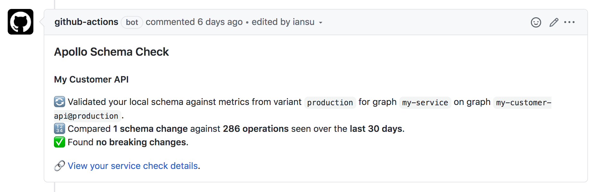

# Apollo Schema Check Action

[](https://github.com/iansu/apollo-schema-check-action/actions)
[](https://codecov.io/gh/iansu/apollo-schema-check-action)

A GitHub Action to run a schema check using the [Apollo CLI](https://www.apollographql.com/docs/devtools/cli/) and [Apollo Studio](https://www.apollographql.com/docs/studio/) (formerly Graph Manager) and post the results as a comment on a Pull Request

## Usage

Create a file in your repo named `.github/workflows/schema_check.yml` with the following contents:

```yml
name: Schema Check

on:
  pull_request:
    types: [opened, reopened, synchronize]

jobs:
  check_schema:
    name: check schema
    runs-on: ubuntu-latest
    timeout-minutes: 5
    steps:
      - uses: actions/checkout@v2
      - name: Customer API check
        uses: iansu/apollo-schema-check-action@v1
        with:
          title: Customer API
          graph: my-customer-api
          variant: production
          localSchemaFile: 'schema.graphql'
          serviceName: my-service
          validationPeriod: P2W
          key: ${{ secrets.APOLLO_KEY }}
        env:
          GITHUB_TOKEN: ${{ secrets.GITHUB_TOKEN }}
```

When you create a new PR that includes schema changes the results of the schema check will be posted as a comment. Here's an example of what that looks like:



Note that you won't see a comment if your PR doesn't include any schema changes.

## Settings

Almost all of the settings from the [Apollo CLI `schema:check` command](https://github.com/apollographql/apollo-tooling/tree/master/packages/apollo#apollo-servicecheck) are supported, with the following differences:

1. The `json` and `markdown` options have been removed because this action requires markdown to post a comment on your PR
1. The `header` option works slightly different, you pass it a comma separated list of headers. For example: `Header1=Value,Header2=Value2`.

Some additional settings have also been added:

| Name          | Description                                                             | Default | Required |
| ------------- | ----------------------------------------------------------------------- | ------- | -------- |
| title         | The name of the graph which will be shown in the comment                |         | No       |
| alwaysComment | Leave a comment on the PR even if there are no schema changes in the PR | false   | No       |
| failOnError   | Fail the check if breaking changes or composition errors are found      | true    | No       |

## Why use this instead of the Apollo GitHub App

This Action offers some features that the Apollo GitHub App doesn't. If you don't need these features then you should consider using it instead. The main differences are:

1. You don't have to install an app in your org or repo to use this Action
1. This Action posts a comment with the results directly on your PR
1. This Action supports multiple graphs

## Credits

Made with :tumbler_glass: by [Ian Sutherland](https://iansutherland.ca) ([@iansu](https://twitter.com/iansu)). This project is released under the [MIT](/LICENSE) license.
